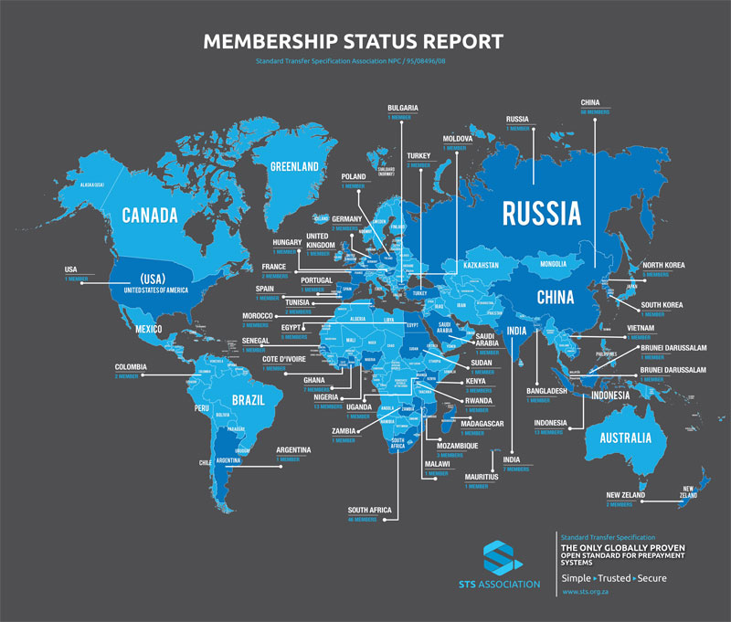

# Demand Stimulation Initiative (DSI)

**Enabling appliance-specific tariffs for emerging household electricity demand.**

The Demand Stimulation Initiative is an R&D project focused on enabling targeted electricity tariffs for specific household uses, starting with electric cooking and e-mobility charging.

In many households, the electricity meter records total electricity consumption. It does not show how much electricity was used for cooking, charging an electric motorcycle, lighting, refrigeration, entertainment, or other needs. This creates a challenge for tariff design. If a utility or regulator wants to introduce a special tariff, credit, or rebate for electric cooking or e-mobility, there must first be a reliable way to identify and verify the electricity used for that purpose within the household.

DSI is designed to create a technical pathway for doing this without requiring immediate replacement of the entire household metering system.

## The problem

Electric cooking and electric mobility are emerging as important new sources of electricity demand. They can become major household and community-level offtakers, creating new revenue opportunities for utilities while supporting cleaner cooking, cleaner transport, and better use of the electricity system.

However, this new demand also creates a tariff and infrastructure challenge.

Most household electricity meters only record total electricity use. They do not show whether electricity was used for cooking, charging an electric motorcycle, lighting, refrigeration, entertainment, or other needs. This makes it difficult to apply targeted tariffs to specific household uses.

At the same time, many utilities are under pressure. Electricity demand growth is needed to improve revenue and make better use of existing generation and network assets. Without new and productive demand, utilities risk becoming financially unsustainable, especially where customer consumption remains low but the cost of maintaining and expanding infrastructure continues to rise.

New demand can also increase the need for infrastructure upgrades. If cooking and e-mobility loads are not measured, managed, or priced properly, they may contribute to local network stress, transformer overloads, peak demand growth, and higher investment requirements. Utilities may then face the cost of upgrading distribution infrastructure without having the right data to understand which loads are driving demand and how tariff design could shape usage.

The project therefore asks:

> How can electric cooking and e-mobility demand be identified, verified, and supported through targeted household tariffs without requiring immediate replacement of the entire household metering system?

## Standards foundation

DSI is being developed to work as an extension of the STS and IEC standards environment that utilities already trust.

### Why STS matters

The **Standard Transfer Specification (STS)** is the global standard for the transfer of electricity and other utility prepayment tokens. It is designed to ensure interoperability between system components from different manufacturers. The STS Association describes STS as a widely used, open IEC standard with a large vendor ecosystem, global key-management support, and strong interoperability.

This is why STS is the **de-facto approach** for prepaid electricity markets in many countries:

- it is already widely deployed in utility metering systems;
- it is recognized through the **IEC 62055** standards family;
- it supports interoperability across vendors and utilities;
- it is backed by the STS Association’s governance, certification, and key-management services; and
- it fits the practical reality of existing household metering infrastructure, especially in Africa and other prepaid markets.

For DSI, this matters because targeted tariffs will only scale if they can work with the infrastructure that utilities already operate. Rather than proposing an entirely separate measurement and settlement path, DSI is intended to align appliance-level and clip-on telemetry approaches with the same metering and payment environment utilities already use.

### How DSI leverages the standards ecosystem

DSI is designed to build on the **STS Association and IEC standards ecosystem**, rather than bypass it.

In practical terms, this means:

- aligning with the **IEC 62055** STS framework where tariff application, tokenization, and utility-side processes are relevant;
- designing metering and telemetry concepts that can be reconciled with the utility meter, rather than relying only on third-party appliance readings;
- using recognised **IEC metering and testing standards** as the basis for measurement credibility, accuracy, and product acceptance; and
- creating a pathway that utilities, regulators, manufacturers, and programme partners can all recognise as technically credible.

### STS Association global footprint

The official STS Association footprint shows the breadth of the ecosystem and why it remains the practical reference point for prepaid electricity markets.

*Source: STS Association membership status report / global footprint map.*

## The approach

Our approach is to develop and test a practical system that makes specific household electricity uses visible and tariff-ready. The first focus is electric cooking and e-mobility charging.

The proposed pathway combines appliance-level measurement with a clip-on telemetry unit located near the household meter. Appliance meters record electricity used by approved appliances, while the clip-on unit collects this information, links it to the household electricity account, checks it against total household consumption where possible, and sends verified data to a tariff-facing platform.

This creates a pathway for applying targeted tariffs, credits, or rebates without requiring immediate replacement of existing household meters.

## Objectives

- Develop a practical technical solution for targeted household tariffs.
- Enable measurement of specific household electricity uses.
- Support electricity demand growth from electric cooking and e-mobility.
- Improve utility visibility of emerging household loads.
- Prepare the model for piloting, adoption, and scale-up.

## Why this matters

DSI is not only about increasing electricity use. It is about making new household demand measurable, verifiable, and usable for targeted tariff application.

For utilities, DSI creates a pathway to grow electricity demand while managing network constraints, infrastructure costs, and the operational impacts of new household loads.

For customers, it creates the possibility of targeted tariffs, credits, or rebates for beneficial electricity uses such as electric cooking and e-mobility charging.

For manufacturers, it creates a pathway for appliances and equipment to support tariff eligibility through verified usage data. However, DSI recognises that this capability should not significantly increase the cost of appliances for price-sensitive customers. If the added metering or telemetry cost is passed directly to customers, it could raise asset acquisition prices and slow adoption.
